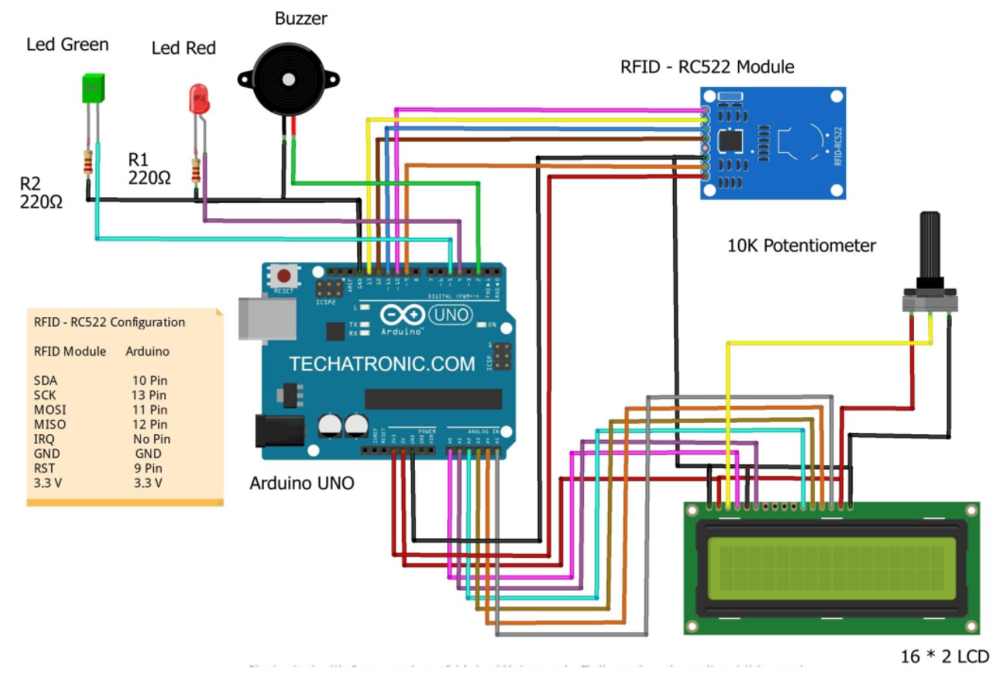
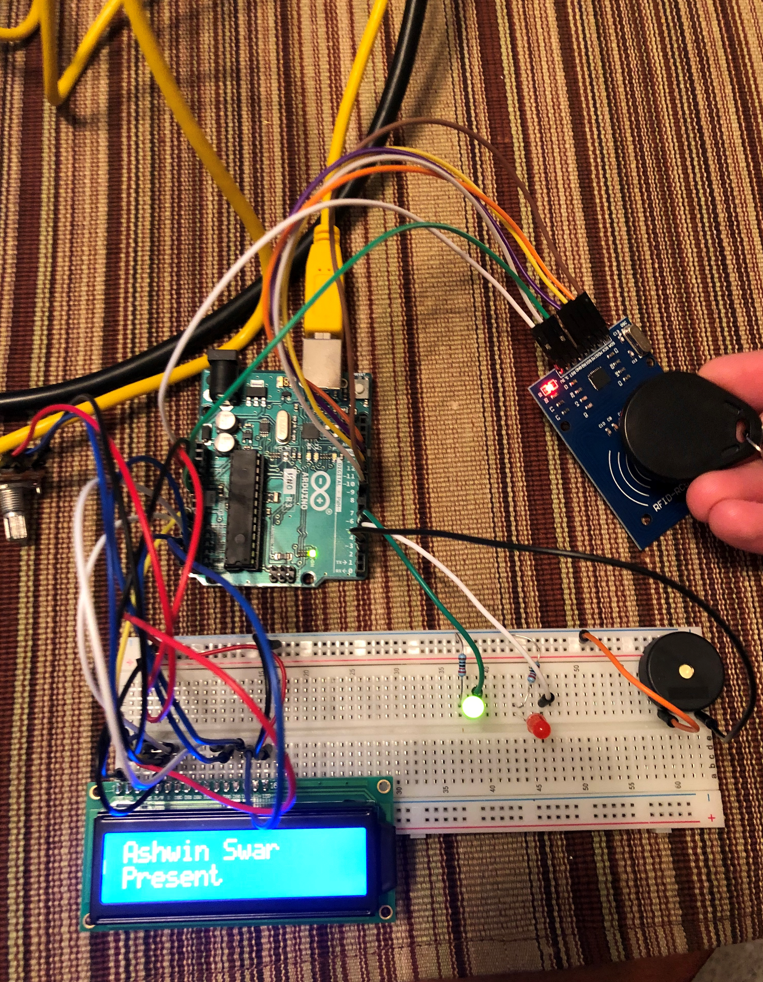
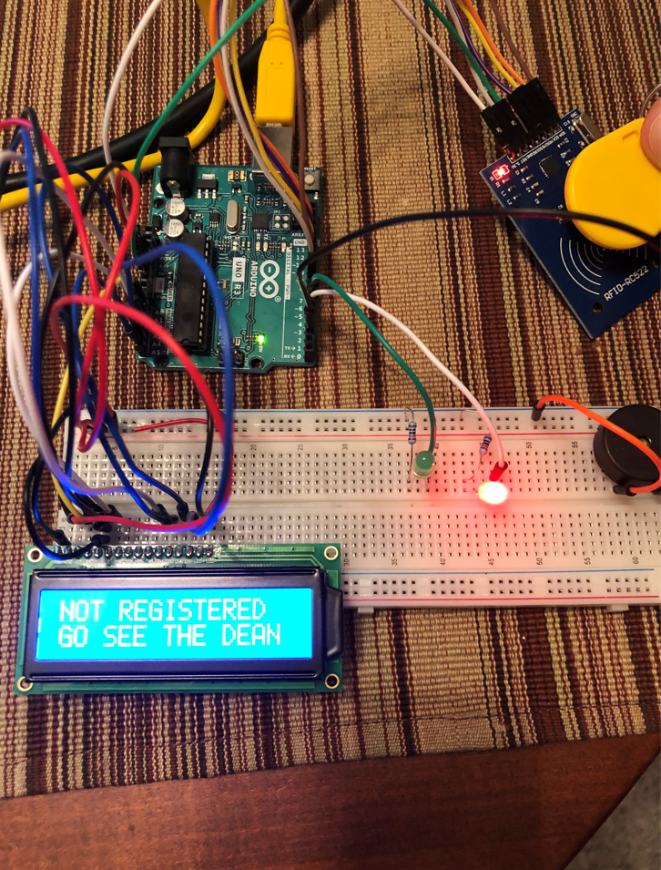
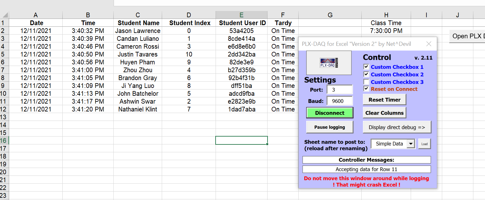

# RFID-Attendence-System
Here is a project I did with four other friends (Jason Lawrence, Cameron Rossi, Candan Luiano) for RFID class. My contribution was mostly on the doftware side and a little bit on debugging the hardware. In this project we implement an RFID based attendence system. Students can tap their ID tags and their time of attendence will be recorded to the memory. All of this was implemented on Arduino. We also implemented LCD outputs to show student informations when the tags are tapped. There are also LED and buzzers to give audio and visual feedback for correct attandence and faulty ones. 

## Here are some images showing different states of the system:
###This is what the overall system disgram looks like.  
 
###This is what idel state looks like 
 
###This is what a correct attendence looks like 
 
###This is when someone unregistered tries to get in. 
 
###The attendence is recorded to the computer in an Excel file automatically. 
 

